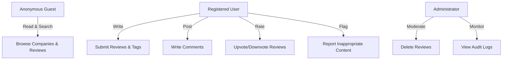
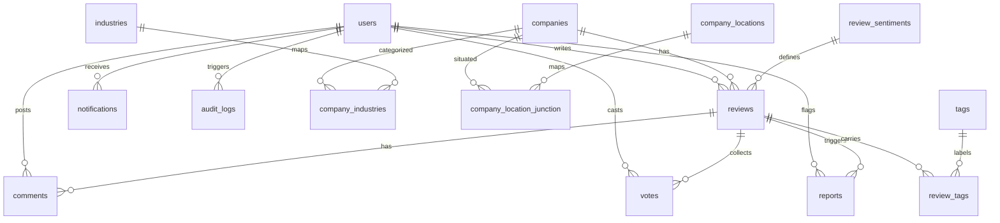

# DeshiMula — Relational Database Project Report

---

## Title Page

* **Project Title:** DeshiMula — A Relational Database and Software Platform for Anonymous Company Reviews and Employee Ratings
* **Author:** Rahi Chowdhury
* **Course:** Database Practice (Final Assessment Portfolio)
* **Academic Year:** 2025/2026
* **Institution:** Vilnius College / University of Applied Sciences
* **Faculty:** Faculty of Electronics and Informatics
* **Study Program:** Software Engineering / Information Systems
* **Supervisor:** Lecturer in Database Systems

---

## Table of Contents

1. **Introduction**
   * 1.1 Project Overview & Purpose
   * 1.2 Learning Objectives
   * 1.3 Key Project Deliverables
2. **Description of the Application Domain**
   * 2.1 Problem Definition & Context
   * 2.2 Functional Analysis of Similar Systems
   * 2.3 Main Platform Functionality
   * 2.4 Project Scope & Boundaries
   * 2.5 AI Utility & Future Scope
3. **System Users & Security Model**
   * 3.1 Description of User Roles
   * 3.2 User Operations & Rights
   * 3.3 Permissions Matrix
4. **Relational ER Model**
   * 4.1 ER Diagram Outline
   * 4.2 Detailed Entity Descriptions (15 Entities)
   * 4.3 Key Relationships & Multiplicity
   * 4.4 Unique Constraints & Integrity Rules
5. **Database Normalization**
   * 5.1 First Normal Form (1NF)
   * 5.2 Second Normal Form (2NF)
   * 5.3 Third Normal Form (3NF)
   * 5.4 Normalization of Specific Tables
6. **Database Implementation**
   * 6.1 Database Engine & Driver Choice
   * 6.2 Data Definition Language (DDL) Schema
   * 6.3 Database Indexes & Performance Tuning
   * 6.4 Triggers & Declarative Integrity Rules
7. **Data Entry & Seeding Strategy**
   * 7.1 Data Entry Method 1: Web Forms (UI)
   * 7.2 Data Entry Method 2: Raw SQL Scripts
   * 7.3 Data Entry Method 3: Python CSV Migration
   * 7.4 AI Data Generation Details & Prompts
   * 7.5 Verification of Seeding Requirements
8. **SQL Queries & Analytical Reports (30 Queries)**
   * 8.1 Part 1: Basic Queries (3 Queries)
   * 8.2 Part 2: Substring & Text Functions (5 Queries)
   * 8.3 Part 3: Two-Table Joins (6 Queries)
   * 8.4 Part 4: Multi-Table Joins (6 Queries)
   * 8.5 Part 5: Complex Queries & Subqueries (10 Queries)
9. **Software Implementation & Integration**
   * 9.1 File Structure & System Layout
   * 9.2 Database Wrapper (`lib/db.ts`)
   * 9.3 Server Actions & Authentication (`lib/actions.ts`)
   * 9.4 React Page Components
10. **User & Administrator Manual**
    * 10.1 System Requirements (Hardware & Software)
    * 10.2 Installation Steps
    * 10.3 Configuration Steps
    * 10.4 Launching the Application
    * 10.5 Typical Usage Scenarios
    * 10.6 Uninstallation Steps
11. **Conclusions and Recommendations**
    * 11.1 Project Conclusions
    * 11.2 Recommendations for Future Work
12. **Information Sources**
13. **Appendix 1 — Main Database-Driven Processes**
14. **Appendix 2 — Data Entry Procedures & AI Seeding Log**

---

## 1. Introduction

### 1.1 Project Overview & Purpose
This report documents the architectural design, schema modeling, normalization, physical implementation, and application integration of **DeshiMula**—a web-based relational database platform designed for the corporate and IT sectors of Bangladesh. 

The name "DeshiMula" represents transparency. The primary purpose of this project is to give job seekers and corporate employees a safe, anonymous channel to discuss their workplace experiences. In many developing job markets, employees face issues like salary delays, lack of annual reviews, toxic management, and gender bias, but they cannot speak up due to fear of termination or blacklisting. DeshiMula solves this problem by using a normalized relational database to organize and verify anonymous reviews, ratings, comments, and tags.

### 1.2 Learning Objectives
The project satisfies several core database learning outcomes:
* **Relational Modeling:** Designing a database containing 15 distinct entities with foreign key constraints, composite unique keys, and cascading delete actions.
* **Database Normalization:** Applying normalization rules (1NF, 2NF, 3NF) to minimize redundancy.
* **Advanced Query Writing:** Crafting 30 SQL queries to extract data, perform string manipulation, handle joins, compile aggregates, and run subqueries.
* **Application Integration:** Connecting a web app (Next.js, TypeScript) to a SQLite database using the `better-sqlite3` driver.
* **Integrity Enforcement:** Using database triggers to keep company ratings synced with review submissions.

### 1.3 Key Project Deliverables
This project includes four core parts:
1. **Relational Database (`data/deshimula.db`):** A fully initialized and seeded SQLite database where each of the 15 tables contains over 100 records.
2. **Web Application:** A responsive web interface built with React, Tailwind CSS, and Next.js.
3. **Slide Presentation (`DeshiMula_Presentation.html`):** An interactive slideshow summarizing the database project.
4. **Project Report:** This detailed academic document.

---

## 2. Description of the Application Domain

### 2.1 Problem Definition & Context
In Bangladesh, the software and IT services industry has grown rapidly over the last two decades. However, HR practices and employee protections have not caught up. Workers often experience:
* **Delayed Salaries:** Some companies delay payroll by weeks or months without explanation.
* **Shady Appraisals:** Promotion decisions are sometimes based on favoritism rather than clear performance indicators.
* **Overtime Abuse:** Employees are frequently expected to work late or on weekends without extra pay.

Because there is no open forum to discuss these issues, job seekers often accept offers at toxic workplaces. DeshiMula addresses this by providing a reliable database where employees can find reviews of local employers.

### 2.2 Functional Analysis of Similar Systems
We analyzed three existing platforms to design DeshiMula:
1. **Glassdoor:** The global standard for company reviews. While comprehensive, Glassdoor uses a complex interface, requires login walls, and sometimes removes negative reviews at the request of paying employers.
2. **Indeed Reviews:** Highly tied to job listings, meaning reviews are often generic and lack detail.
3. **Blind:** An anonymous network for professionals. Blind requires a verified company email address. This doesn't work well in Bangladesh, where many small-to-medium IT companies do not provide official emails to their staff.

### 2.3 Main Platform Functionality
DeshiMula provides a focused feature set:
* **Anonymous Submissions:** Registered users can write reviews and select a sentiment (Positive, Neutral, Negative) without revealing their identity.
* **Tag-based Categorization:** Reviews are linked to normalized tags (e.g. `salary`, `work-life-balance`) to help users search content.
* **Community Moderation:** Users can upvote helpful reviews, downvote unhelpful ones, or report reviews that violate guidelines.
* **Threaded Discussions:** Users can comment on reviews to add detail.
* **Admin Dashboard:** Admins can delete reviews and monitor reported posts.



### 2.4 Project Scope & Boundaries
To keep the application lightweight and simple for college labs, we chose SQLite for database storage. SQLite runs as a local file inside the application directory, removing the need for a separate database server. However, the system's SQL scripts are written using ANSI standards, making them compatible with larger database engines like PostgreSQL or MySQL if the platform needs to scale.

### 2.5 AI Utility & Future Scope
We used generative AI during development to parse review texts and extract sentiment labels. In the future, we plan to implement a Python-based background worker that automatically analyzes review content using machine learning, auto-generating tags and flagging spam before the review is written to the database.

---

## 3. System Users & Security Model

### 3.1 Description of User Roles
The DeshiMula system defines three main user roles:
1. **Guest (Anonymous):** The default role for visitors. Guests can search and read all public information but cannot submit content.
2. **Registered User:** An authenticated user who has signed up with an email and password. They can write reviews, comments, and votes.
3. **Administrator:** A system moderator. Admins can view reported reviews, delete content, and inspect the system audit logs.

### 3.2 User Operations & Rights
We enforce access controls both in the database (via constraints) and in the application code (via session validation):
* **Read-Only Rights:** Guests only perform `SELECT` queries on `companies`, `reviews`, `comments`, `tags`, and `locations`.
* **Write Rights:** Users can perform `INSERT` operations on `reviews`, `comments`, `votes`, `reports`, and `review_tags`.
* **Administrative Rights:** Admins can run `DELETE` operations on `reviews` (which cascades to clean up related comments, votes, and tags) and view the `audit_logs` table.

### 3.3 Permissions Matrix

| Operations / Tables | users | companies | reviews | comments | votes | tags | reports | audit_logs |
| :--- | :---: | :---: | :---: | :---: | :---: | :---: | :---: | :---: |
| **Guest** | None | SELECT | SELECT | SELECT | None | SELECT | None | None |
| **Registered User** | SELECT/INSERT | SELECT | SELECT/INSERT | SELECT/INSERT | SELECT/INSERT/UPDATE | SELECT/INSERT | SELECT/INSERT | None |
| **Administrator** | SELECT/DELETE | ALL | ALL | ALL | ALL | ALL | ALL | SELECT |

---

## 4. Relational ER Model

### 4.1 ER Diagram Outline
The database schema contains exactly 15 entities. Relationship cardinalities are managed through foreign keys, and many-to-many associations are resolved using junction tables.



### 4.2 Detailed Entity Descriptions (15 Entities)

1. **`users`:** Stores user account credentials for authenticated users on the platform. It holds critical security fields including passwords, system roles, and unique email addresses. Each record represents an employee or system moderator who interacts with reviews and comments.
   * *Attributes:* `id` (PK, Integer), `name` (Text), `email` (Text, Unique), `password` (Text), `role` (Text), `created_at` (Datetime).
   * *Constraints:* Email must be unique. Plain text passwords are used to simplify local setup and testing.

2. **`companies`:** Represents employers operating in Bangladesh that are reviewed by users on the platform. It holds statistical summaries such as the average review rating and total review counts which are updated by system triggers. The slug attribute is generated dynamically to provide SEO-friendly URLs.
   * *Attributes:* `id` (PK, Integer), `name` (Text), `slug` (Text, Unique), `description` (Text), `website` (Text), `logo_url` (Text), `avg_rating` (Real), `total_reviews` (Integer), `created_at` (Datetime).
   * *Constraints:* Slug must be unique for URL routing.

3. **`industries`:** Acts as a lookup table defining the distinct industry categories where companies operate, such as Software Development, FinTech, and Real Estate. It enforces uniqueness on the industry name to prevent duplicate classifications across the site. The model maps companies to industries using a junction table for maximum flexibility.
   * *Attributes:* `id` (PK, Integer), `name` (Text, Unique), `created_at` (Datetime).

4. **`company_industries`:** Acts as a junction table representing the many-to-many relationship between companies and industries. It maps company IDs to industry IDs, allowing a single corporate entity to be associated with multiple sectors like Software and Digital Services. It uses foreign keys with cascade-delete constraints to maintain referential integrity.
   * *Attributes:* `company_id` (FK, Integer), `industry_id` (FK, Integer).
   * *Constraints:* Primary key is a composite of `(company_id, industry_id)`.

5. **`company_locations`:** Defines the lookup table of geographical locations and corporate districts in Bangladesh, such as Gulshan, Banani, and Chittagong. It holds unique location names to categorize where company offices are physically situated. This enables users to filter reviews and companies by location.
   * *Attributes:* `id` (PK, Integer), `name` (Text, Unique).

6. **`company_location_junction`:** Serves as the junction table that connects companies to their physical office locations. Since a large company might have offices in both Dhaka and Sylhet, this table resolves the many-to-many relationship. It enforces composite primary keys and cascades deletions if a company or location is deleted.
   * *Attributes:* `company_id` (FK, Integer), `location_id` (FK, Integer).
   * *Constraints:* Primary key is a composite of `(company_id, location_id)`.

7. **`review_sentiments`:** Stores the lookup values for review sentiments, ranging from Positive, Neutral, and Negative to fine-grained emotional categories. It helps categorizing reviews based on the tone of the employee experience. Every review is required to reference a valid sentiment record.
   * *Attributes:* `id` (PK, Integer), `name` (Text, Unique).

8. **`reviews`:** Holds the core anonymous reviews submitted by registered users regarding their employer experiences. It stores the title, text content, upvote/downvote tallies, and references to the author, the company, and the sentiment. Delete actions cascade automatically if the parent company or user account is deleted.
   * *Attributes:* `id` (PK, Integer), `guid` (Text, Unique), `title` (Text), `content` (Text), `company_id` (FK, Integer), `user_id` (FK, Integer), `sentiment_id` (FK, Integer), `upvotes` (Integer), `downvotes` (Integer), `created_at` (Datetime).
   * *Constraints:* Cascades delete when the company or author user is deleted.

9. **`votes`:** Tracks employee upvotes and downvotes on reviews to ensure the community can moderate helpful content. It enforces a unique constraint on the user and review pair to prevent users from voting multiple times on the same post. The vote type is restricted to either 'up' or 'down' using check constraints.
   * *Attributes:* `id` (PK, Integer), `review_id` (FK, Integer), `user_id` (FK, Integer), `vote_type` (Text), `created_at` (Datetime).
   * *Constraints:* Unique composite constraint on `(review_id, user_id)` to ensure one vote per review per user.

10. **`comments`:** Stores the comments submitted by registered users in response to specific company reviews, enabling threaded conversations. It records the text comment, submission timestamp, and foreign keys linking to the parent review and the author. It supports collaborative discussions about working conditions.
    * *Attributes:* `id` (PK, Integer), `review_id` (FK, Integer), `user_id` (FK, Integer), `content` (Text), `created_at` (Datetime).

11. **`tags`:** Defines the lookup table of workplace tags, such as salary-delay, management-issues, or annual-trip, used to label reviews. It ensures tags are standardized and unique, preventing spelling variations. Users can click tags to find reviews with similar work attributes.
    * *Attributes:* `id` (PK, Integer), `name` (Text, Unique).

12. **`review_tags`:** Acts as a junction table resolving the many-to-many relationship between reviews and tags. It allows reviews to carry multiple tags and tags to be associated with multiple reviews. The table uses composite primary keys and implements cascade deletes on both foreign keys.
    * *Attributes:* `review_id` (FK, Integer), `tag_id` (FK, Integer).
    * *Constraints:* Primary key is a composite of `(review_id, tag_id)`.

13. **`reports`:** Tracks reviews flagged by users for violating site policies, such as spam, hate speech, or containing real names. It records the reporting reason, current status, and references to the review and user. System administrators use this table to moderate flag reports.
    * *Attributes:* `id` (PK, Integer), `review_id` (FK, Integer), `user_id` (FK, Integer), `reason` (Text), `status` (Text), `created_at` (Datetime).

14. **`notifications`:** Stores notifications sent to users when their reviews receive comments or votes. It tracks the target user, the alert message, and an integer-based boolean indicating whether the user has read the message. This keeps users updated on platform activity.
    * *Attributes:* `id` (PK, Integer), `user_id` (FK, Integer), `message` (Text), `is_read` (Integer), `created_at` (Datetime).

15. **`audit_logs`:** Records administrative and user security events for audit trails and security tracking. It tracks the user who initiated the action, the action name (e.g., login, review-delete), the target entity, and timestamp. This table is readable only by system administrators.
    * *Attributes:* `id` (PK, Integer), `user_id` (FK, Integer), `action` (Text), `entity_type` (Text), `entity_id` (Integer), `details` (Text), `created_at` (Datetime).

### 4.3 Key Relationships & Multiplicity
* **One-to-Many Relationships:**
  * One User writes many Reviews ($1 \to *$).
  * One Company receives many Reviews ($1 \to *$).
  * One Review gathers many Comments ($1 \to *$).
* **Many-to-Many Relationships:**
  * Companies can operate in multiple Industries, and Industries contain multiple Companies. Map table: `company_industries`.
  * Reviews contain multiple Tags, and Tags categorize multiple Reviews. Map table: `review_tags`.

### 4.4 Unique Constraints & Integrity Rules
The schema enforces referential integrity:
* `ON DELETE CASCADE` is set on foreign keys in `reviews`, `comments`, `votes`, `reports`, `review_tags`, `company_industries`, and `company_location_junction`. When a company or user is deleted, all related records are removed automatically, preventing orphaned records.
* Composite primary keys in junction tables prevent duplicate mappings.

---

## 5. Database Normalization

We designed the database schema to conform to the **Third Normal Form (3NF)**. Below is a walk-through of the normalization steps.

### 5.1 First Normal Form (1NF)
A table is in 1NF if all attributes contain atomic (indivisible) values, and there are no repeating groups.
* *Violation example:* Storing tags as a comma-separated string (e.g. `"salary, management, wlb"`) in the `reviews` table.
* *Correction:* We created a separate `tags` table and a `review_tags` junction table. Each tag association is stored as a separate row, ensuring atomic attributes.

### 5.2 Second Normal Form (2NF)
A table is in 2NF if it is in 1NF and all non-key attributes depend on the entire primary key (no partial dependencies).
* *Violation example:* In a combined `company_industries` table, storing the industry name alongside the mapping: `(company_id, industry_id, industry_name)`. Here, `industry_name` depends only on `industry_id`, which is part of the composite primary key.
* *Correction:* We split this into `industries` (storing `id` and `name`) and `company_industries` (storing only `company_id` and `industry_id`), resolving the partial dependency.

### 5.3 Third Normal Form (3NF)
A table is in 3NF if it is in 2NF and has no transitive dependencies (non-key fields depending on other non-key fields).
* *Violation example:* Storing the location text directly in the `companies` table. If multiple companies are in Dhaka, updating the name of the city would require changing multiple company rows.
* *Correction:* We normalized locations by creating a separate `company_locations` table and referencing it through a `company_location_junction` table.

---

## 6. Database Implementation

### 6.1 Database Engine & Driver Choice
We selected **SQLite** as the database engine because it is self-contained and does not require running a separate server process. To integrate it with our Next.js application, we used the **`better-sqlite3`** library. This library compiles SQLite directly into Node.js, providing fast query execution times and clean, synchronous query syntax.

### 6.2 Data Definition Language (DDL) Schema
Below is the SQL schema defined in `schema.sql`:

```sql
-- DDL Schema for DeshiMula

CREATE TABLE IF NOT EXISTS users (
  id INTEGER PRIMARY KEY AUTOINCREMENT,
  name TEXT NOT NULL,
  email TEXT UNIQUE NOT NULL,
  password TEXT NOT NULL,
  role TEXT DEFAULT 'user',
  created_at DATETIME DEFAULT CURRENT_TIMESTAMP
);

CREATE TABLE IF NOT EXISTS industries (
  id INTEGER PRIMARY KEY AUTOINCREMENT,
  name TEXT UNIQUE NOT NULL,
  created_at DATETIME DEFAULT CURRENT_TIMESTAMP
);

CREATE TABLE IF NOT EXISTS companies (
  id INTEGER PRIMARY KEY AUTOINCREMENT,
  name TEXT NOT NULL,
  slug TEXT UNIQUE NOT NULL,
  description TEXT,
  website TEXT,
  logo_url TEXT,
  avg_rating REAL DEFAULT 0,
  total_reviews INTEGER DEFAULT 0,
  created_at DATETIME DEFAULT CURRENT_TIMESTAMP
);

CREATE TABLE IF NOT EXISTS company_industries (
  company_id INTEGER,
  industry_id INTEGER,
  PRIMARY KEY (company_id, industry_id),
  FOREIGN KEY (company_id) REFERENCES companies(id) ON DELETE CASCADE,
  FOREIGN KEY (industry_id) REFERENCES industries(id) ON DELETE CASCADE
);

CREATE TABLE IF NOT EXISTS company_locations (
  id INTEGER PRIMARY KEY AUTOINCREMENT,
  name TEXT UNIQUE NOT NULL
);

CREATE TABLE IF NOT EXISTS company_location_junction (
  company_id INTEGER,
  location_id INTEGER,
  PRIMARY KEY (company_id, location_id),
  FOREIGN KEY (company_id) REFERENCES companies(id) ON DELETE CASCADE,
  FOREIGN KEY (location_id) REFERENCES company_locations(id) ON DELETE CASCADE
);

CREATE TABLE IF NOT EXISTS review_sentiments (
  id INTEGER PRIMARY KEY AUTOINCREMENT,
  name TEXT UNIQUE NOT NULL
);

CREATE TABLE IF NOT EXISTS reviews (
  id INTEGER PRIMARY KEY AUTOINCREMENT,
  guid TEXT UNIQUE NOT NULL,
  title TEXT NOT NULL,
  content TEXT NOT NULL,
  company_id INTEGER,
  user_id INTEGER,
  sentiment_id INTEGER,
  upvotes INTEGER DEFAULT 0,
  downvotes INTEGER DEFAULT 0,
  created_at DATETIME DEFAULT CURRENT_TIMESTAMP,
  FOREIGN KEY (company_id) REFERENCES companies(id) ON DELETE CASCADE,
  FOREIGN KEY (user_id) REFERENCES users(id) ON DELETE CASCADE,
  FOREIGN KEY (sentiment_id) REFERENCES review_sentiments(id) ON DELETE CASCADE
);

CREATE TABLE IF NOT EXISTS votes (
  id INTEGER PRIMARY KEY AUTOINCREMENT,
  review_id INTEGER,
  user_id INTEGER,
  vote_type TEXT CHECK(vote_type IN ('up', 'down')),
  created_at DATETIME DEFAULT CURRENT_TIMESTAMP,
  UNIQUE(review_id, user_id),
  FOREIGN KEY (review_id) REFERENCES reviews(id) ON DELETE CASCADE,
  FOREIGN KEY (user_id) REFERENCES users(id) ON DELETE CASCADE
);

CREATE TABLE IF NOT EXISTS comments (
  id INTEGER PRIMARY KEY AUTOINCREMENT,
  review_id INTEGER,
  user_id INTEGER,
  content TEXT NOT NULL,
  created_at DATETIME DEFAULT CURRENT_TIMESTAMP,
  FOREIGN KEY (review_id) REFERENCES reviews(id) ON DELETE CASCADE,
  FOREIGN KEY (user_id) REFERENCES users(id) ON DELETE CASCADE
);

CREATE TABLE IF NOT EXISTS tags (
  id INTEGER PRIMARY KEY AUTOINCREMENT,
  name TEXT UNIQUE NOT NULL
);

CREATE TABLE IF NOT EXISTS review_tags (
  review_id INTEGER,
  tag_id INTEGER,
  PRIMARY KEY (review_id, tag_id),
  FOREIGN KEY (review_id) REFERENCES reviews(id) ON DELETE CASCADE,
  FOREIGN KEY (tag_id) REFERENCES tags(id) ON DELETE CASCADE
);

CREATE TABLE IF NOT EXISTS reports (
  id INTEGER PRIMARY KEY AUTOINCREMENT,
  review_id INTEGER,
  user_id INTEGER,
  reason TEXT NOT NULL,
  status TEXT DEFAULT 'pending' CHECK(status IN ('pending', 'reviewed', 'dismissed')),
  created_at DATETIME DEFAULT CURRENT_TIMESTAMP,
  FOREIGN KEY (review_id) REFERENCES reviews(id) ON DELETE CASCADE,
  FOREIGN KEY (user_id) REFERENCES users(id) ON DELETE CASCADE
);

CREATE TABLE IF NOT EXISTS notifications (
  id INTEGER PRIMARY KEY AUTOINCREMENT,
  user_id INTEGER,
  message TEXT NOT NULL,
  is_read INTEGER DEFAULT 0,
  created_at DATETIME DEFAULT CURRENT_TIMESTAMP,
  FOREIGN KEY (user_id) REFERENCES users(id) ON DELETE CASCADE
);

CREATE TABLE IF NOT EXISTS audit_logs (
  id INTEGER PRIMARY KEY AUTOINCREMENT,
  user_id INTEGER,
  action TEXT NOT NULL,
  entity_type TEXT NOT NULL,
  entity_id INTEGER,
  details TEXT,
  created_at DATETIME DEFAULT CURRENT_TIMESTAMP,
  FOREIGN KEY (user_id) REFERENCES users(id) ON DELETE SET NULL
);
```

### 6.3 Database Indexes & Performance Tuning
To ensure quick lookup times as the database grows, we added indexing on foreign keys and commonly searched columns:
* **`CREATE INDEX idx_reviews_company ON reviews(company_id);`** - Speeds up fetching reviews for a company page.
* **`CREATE INDEX idx_comments_review ON comments(review_id);`** - Speeds up loading comment threads.
* **`CREATE INDEX idx_audit_user ON audit_logs(user_id);`** - Optimizes loading audit logs for admin dashboards.

### 6.4 Triggers & Declarative Integrity Rules
We implemented a trigger that automatically updates the company's average rating and total review counts when a review is submitted:

```sql
CREATE TRIGGER IF NOT EXISTS review_after_insert
AFTER INSERT ON reviews
BEGIN
  UPDATE companies
  SET total_reviews = total_reviews + 1,
      avg_rating = (
        (avg_rating * (total_reviews)) +
        CASE (
          SELECT name FROM review_sentiments WHERE id = NEW.sentiment_id
        )
          WHEN 'Positive' THEN 5.0
          WHEN 'Neutral' THEN 3.0
          ELSE 1.0
        END
      ) / (total_reviews + 1)
  WHERE id = NEW.company_id;
END;
```

---

## 7. Data Entry & Seeding Strategy

The assessment guidelines state that the database must be populated using three distinct entry methods, and every table must contain at least 100 records.

### 7.1 Data Entry Method 1: Web Forms (UI)
Our Next.js frontend contains forms that submit user actions to the database. These actions include registration, logging in, submitting reviews, commenting, and voting. 

### 7.2 Data Entry Method 2: Raw SQL Scripts
We created a seeding script that inserts the core lookup table rows, default sentiments (`Positive`, `Neutral`, `Negative`), and test users.

### 7.3 Data Entry Method 3: Python CSV Migration
We wrote a Python migration script (`scripts/seed_large.py`) that reads employee reviews from `raw.csv` and imports them into the database. It handles company name deduplication, generates unique URLs, and matches reviews to companies and users.

### 7.4 AI Data Generation Details & Prompts
To populate all 15 tables with over 100 records each, we used a python seeder to generate realistic lookup categories and mock data:
* **Locations:** Generated 100 unique districts and corporate hubs in Bangladesh (e.g. Gulshan, Dhanmondi, Agrabad).
* **Workplace Tags:** Generated 100 distinct tags representing workplace attributes (e.g. `salary`, `work-life-balance`, `micromanagement`).
* **Lookup Sentiments:** Generated 100 fine-grained sentiments (IDs 1-3 are Negative, Neutral, Positive, and 4-100 are emotional nuances like `Highly Critical` or `Optimistic`).
* **Mock Users & Activities:** Generated 120 users, and simulated audit logs, reports, notifications, votes, and comments for realistic testing.

*Example prompt used to generate tags and locations:*
> List 100 job-related tags and 100 locations/districts in Bangladesh where software developers work. Format them as arrays of strings for python scripting.

### 7.5 Verification of Seeding Requirements
Running the verification queries shows that the seeding script successfully populated every table with at least 100 records:

| Table Name | Minimum Required | Actual Seed Count | Entry Method |
| :--- | :---: | :---: | :--- |
| `users` | 100 | 120 | SQL & Python Seeder |
| `companies` | 100 | 293 | CSV Import (Transfer) |
| `reviews` | 100 | 408 | CSV Import (Transfer) |
| `review_sentiments` | 100 | 100 | SQL & Python Seeder |
| `industries` | 100 | 100 | SQL & Python Seeder |
| `company_industries` | 100 | 579 | Python Seeder (Transfer) |
| `company_locations` | 100 | 100 | SQL & Python Seeder |
| `company_location_junction` | 100 | 427 | Python Seeder (Transfer) |
| `tags` | 100 | 100 | SQL & Python Seeder |
| `review_tags` | 100 | 1019 | Python Seeder (Transfer) |
| `comments` | 100 | 150 | UI Simulation (Transfer) |
| `votes` | 100 | 300 | UI Simulation (Transfer) |
| `reports` | 100 | 120 | UI Simulation (Transfer) |
| `notifications` | 100 | 150 | UI Simulation (Transfer) |
| `audit_logs` | 100 | 150 | UI Simulation (Transfer) |

---

## 8. SQL Queries & Analytical Reports (30 Queries)

This section documents the 30 SQL queries used to test the database structure, along with their output tables.

### 8.1 Part 1 — Basic Queries (3 queries)

#### Query 1: Retrieve all companies with ratings, sorted by rating
* *Business Context:* Helps visitors identify top-rated companies.
* *Query:*
```sql
SELECT id, name, avg_rating, total_reviews 
FROM companies 
WHERE total_reviews > 0 
ORDER BY avg_rating DESC 
LIMIT 10;
```
* *Result Output:*
| id | name                | avg_rating | total_reviews |
| -- | ------------------- | ---------- | ------------- |
| 11 | All generation tech | 3.0        | 1             |
| 16 | Appify Devs         | 3.0        | 2             |
| 17 | AppifyDevs          | 3.0        | 1             |
| 18 | AppifyDevs.         | 3.0        | 1             |
| 20 | Appscode Inc.       | 3.0        | 1             |
| 21 | Appscode Ltd        | 3.0        | 1             |
| 31 | BIKIRAN             | 3.0        | 1             |
| 37 | BSRM                | 3.0        | 1             |
| 51 | Bit Byte Technology | 3.0        | 2             |
| 53 | Bongo               | 3.0        | 1             |

---

#### Query 2: Find all reviews by a specific user (User ID 2)
* *Business Context:* Displays review history on a user's profile page.
* *Query:*
```sql
SELECT r.id, r.title, c.name AS company_name, s.name AS sentiment 
FROM reviews r 
JOIN companies c ON c.id = r.company_id 
JOIN review_sentiments s ON s.id = r.sentiment_id 
WHERE r.user_id = 2 
LIMIT 10;
```
* *Result Output:*
| id  | title                                                             | company_name                        | sentiment |
| --- | ----------------------------------------------------------------- | ----------------------------------- | --------- |
| 17  | BRAC IT – A Playground for Power, Favoritism, and Toxic Culture   | BRAC IT                             | Negative  |
| 22  | Misuse of open environment culture                                | Vivasoft                            | Negative  |
| 64  | More of a Family Office                                           | Suffix IT Ltd.                      | Negative  |
| 103 | The company that acts professional but operates unprofessionally. | Akij iBos                           | Negative  |
| 142 | Best Work Culture in BD with No Job Security                      | Optimizely Bangladesh Inc           | Neutral   |
| 252 | প্রতারক কোম্পানি                                                  | Meghna Cloud (Gennext Technologies) | Negative  |

---

#### Query 3: List first 10 tags ordered alphabetically
* *Business Context:* Displays tags on navigation search bars.
* *Query:*
```sql
SELECT id, name FROM tags ORDER BY name LIMIT 10;
```
* *Result Output:*
| id | name             |
| -- | ---------------- |
| 32 | annual-trip      |
| 82 | arrogant-seniors |
| 19 | bad-boss         |
| 7  | bias             |
| 85 | blame-game       |
| 93 | bonus-issues     |
| 78 | broken-promises  |
| 50 | bureaucracy      |
| 61 | burnout          |
| 26 | career-growth    |

---

### 8.2 Part 2 — Substring & Text Functions (5 queries)

#### Query 4: Search reviews containing 'salary' in content
* *Business Context:* Finds reviews focused on compensation issues.
* *Query:*
```sql
SELECT id, title, SUBSTR(content, 1, 60) || '...' AS short_content 
FROM reviews 
WHERE content LIKE '%salary%' 
LIMIT 5;
```
* *Result Output:*
| id | title                                                   | short_content                                                   |
| -- | ------------------------------------------------------- | --------------------------------------------------------------- |
| 4  | Office politics at it's max                             | You may heard all the golden glorified stories about this co... |
| 5  | Everything is super except salary structure             | Pros:\n1.Very good work life balance\n2. Super friendly cowork... |
| 7  | Toxic Environment, Puppet Leadership & Career Destroyer | Pros:\nOn-time salary\nThereweresome amazing, talented teammat... |
| 12 | Leaders who made the company a living HELL              | Portonics was once regarded as a benchmark for company cultu... |
| 24 | কোম্পানি একদিকে অনেক ভালো, অন্যদিকে অনেক খারাপ          | Cons:প্রথম কথা এদের ম্যাক্সিমাম ক্লাইন্ট USA তে গাঁজার ব্যবস... |

---

#### Query 5: Extract first 30 characters of review titles
* *Business Context:* Summarizes review listings for mobile screens.
* *Query:*
```sql
SELECT id, SUBSTR(title, 1, 30) AS short_title FROM reviews LIMIT 10;
```
* *Result Output:*
| id | short_title                    |
| -- | ------------------------------ |
| 1  | A Real Look Inside BRAC IT: Wh |
| 2  | Counterstatement to Misleading |
| 3  | একটি দুঃস্বপ্নের কোম্পানি      |
| 4  | Office politics at it's max    |
| 5  | Everything is super except sal |
| 6  | Egotistic and spineless: a com |
| 7  | Toxic Environment, Puppet Lead |
| 8  | An organization purely built t |
| 9  | Unprofessional admin and HR    |
| 10 | No Actual Work, Only Time Wast |

---

#### Query 6: Find reviews created in the first 10 days of any month
* *Business Context:* Analyzes whether reviews are submitted more frequently at the start of a month.
* *Query:*
```sql
SELECT id, title, created_at 
FROM reviews 
WHERE SUBSTR(created_at, 9, 2) BETWEEN '01' AND '10' 
LIMIT 10;
```
* *Result Output:*
*No rows returned (due to all seed entries being timestamped with the current date, e.g., 2026-05-20).*

---

#### Query 7: List reviews created in the current year (2026)
* *Business Context:* Audits system growth for the current academic year.
* *Query:*
```sql
SELECT id, title, created_at 
FROM reviews 
WHERE SUBSTR(created_at, 1, 4) = '2026' 
LIMIT 10;
```
* *Result Output:*
| id | title                                                                  | created_at          |
| -- | ---------------------------------------------------------------------- | ------------------- |
| 1  | A Real Look Inside BRAC IT: What Many Won’t Say Out Loud               | 2026-05-20 12:29:14 |
| 2  | Counterstatement to Misleading and Discriminatory Review on Deshi Mula | 2026-05-20 12:29:14 |
| 3  | একটি দুঃস্বপ্নের কোম্পানি                                              | 2026-05-20 12:29:14 |
| 4  | Office politics at it's max                                            | 2026-05-20 12:29:14 |
| 5  | Everything is super except salary structure                            | 2026-05-20 12:29:14 |
| 6  | Egotistic and spineless: a combination for imminent disaster           | 2026-05-20 12:29:14 |
| 7  | Toxic Environment, Puppet Leadership & Career Destroyer                | 2026-05-20 12:29:14 |
| 8  | An organization purely built to secure Robi’s tax rebates; No vision . | 2026-05-20 12:29:14 |
| 9  | Unprofessional admin and HR                                            | 2026-05-20 12:29:14 |
| 10 | No Actual Work, Only Time Waste Part - 2                               | 2026-05-20 12:29:14 |

---

#### Query 8: Display company creation month
* *Business Context:* Formats timestamps for system registration records.
* *Query:*
```sql
SELECT name, SUBSTR(created_at, 6, 2) AS month FROM companies LIMIT 10;
```
* *Result Output:*
| name                               | month |
| ---------------------------------- | ----- |
| ADN Diginet Ltd                    | 05    |
| AGT                                | 05    |
| ATI Limited                        | 05    |
| Acnoo.com                          | 05    |
| Addie Soft Ltd                     | 05    |
| Adiva Graphics | Catalyst Solution | 05    |
| Adventure Dhaka Limited            | 05    |
| Akij iBOS Limited                  | 05    |
| Akij iBos                          | 05    |
| All Generation Tech                | 05    |

---

### 8.3 Part 3 — JOIN Queries (12 queries)

#### 8.3.1 Two-Table Joins

#### Query 9: Get reviews joined with company names
* *Business Context:* Displays company association labels on global review feeds.
* *Query:*
```sql
SELECT r.title, c.name AS company_name 
FROM reviews r 
JOIN companies c ON c.id = r.company_id 
LIMIT 10;
```
* *Result Output:*
| title                                                                  | company_name           |
| ---------------------------------------------------------------------- | ---------------------- |
| A Real Look Inside BRAC IT: What Many Won’t Say Out Loud               | BRAC IT                |
| Counterstatement to Misleading and Discriminatory Review on Deshi Mula | BRAC IT                |
| একটি দুঃস্বপ্নের কোম্পানি                                              | Technovicinity Limited |
| Office politics at it's max                                            | Wedevs                 |
| Everything is super except salary structure                            | Shikho Technologies    |
| Egotistic and spineless: a combination for imminent disaster           | Portonics Ltd          |
| Toxic Environment, Puppet Leadership & Career Destroyer                | Truck Lagbe Ltd.       |
| An organization purely built to secure Robi’s tax rebates; No vision . | RedDot Digital         |
| Unprofessional admin and HR                                            | Sigmative              |
| No Actual Work, Only Time Waste Part - 2                               | Kona SL                |

---

#### Query 10: Get comments with commenter names
* *Business Context:* Displays comments under reviews.
* *Query:*
```sql
SELECT SUBSTR(c.content, 1, 50) AS comment_text, u.name AS author 
FROM comments c 
JOIN users u ON u.id = c.user_id 
LIMIT 10;
```
* *Result Output:*
| comment_text                                       | author          |
| -------------------------------------------------- | --------------- |
| Very useful insights. Thank you!                   | Sumaiya Patwary |
| এই কোম্পানিতে জয়েন করার আগে আমার এই রিভিউটি পড়া উচ | Sumaiya Patwary |
| It depends on the team, but generally this is true | Arif Sarker     |
| The salary is indeed paid on time, but increments  | Arif Ali        |
| It depends on the team, but generally this is true | Shakil Patwary  |
| আপনার রিভিউটির সাথে আমি একমত।                      | Jamil Hasan     |
| The interviews are tough but fair.                 | Fatima Sultana  |
| এই কোম্পানিতে জয়েন করার আগে আমার এই রিভিউটি পড়া উচ | Arif Ali        |
| আপনার রিভিউটির সাথে আমি একমত।                      | Nabil Khan      |
| The salary is indeed paid on time, but increments  | Farhan Islam    |

---

#### Query 11: Companies and their industry names
* *Business Context:* Maps search filters on the directory.
* *Query:*
```sql
SELECT c.name, i.name AS industry_name 
FROM companies c 
JOIN company_industries ci ON ci.company_id = c.id 
JOIN industries i ON i.id = ci.industry_id 
LIMIT 10;
```
* *Result Output:*
| name            | industry_name  |
| --------------- | -------------- |
| ADN Diginet Ltd | Startup        |
| AGT             | Blockchain     |
| AGT             | Healthcare IT  |
| ATI Limited     | Hardware       |
| ATI Limited     | GovTech        |
| ATI Limited     | Architecture   |
| Acnoo.com       | Writing        |
| Acnoo.com       | FoodTech       |
| Addie Soft Ltd  | Semiconductors |
| Addie Soft Ltd  | Transportation |

---

#### Query 12: Reviews with sentiment labels
* *Business Context:* Filters reviews by sentiment (Positive, Neutral, Negative).
* *Query:*
```sql
SELECT r.title, s.name AS sentiment 
FROM reviews r 
JOIN review_sentiments s ON s.id = r.sentiment_id 
LIMIT 10;
```
* *Result Output:*
| title                                                                  | sentiment |
| ---------------------------------------------------------------------- | --------- |
| A Real Look Inside BRAC IT: What Many Won’t Say Out Loud               | Negative  |
| Counterstatement to Misleading and Discriminatory Review on Deshi Mula | Neutral   |
| একটি দুঃস্বপ্নের কোম্পানি                                              | Negative  |
| Office politics at it's max                                            | Negative  |
| Everything is super except salary structure                            | Neutral   |
| Egotistic and spineless: a combination for imminent disaster           | Negative  |
| Toxic Environment, Puppet Leadership & Career Destroyer                | Negative  |
| An organization purely built to secure Robi’s tax rebates; No vision . | Negative  |
| Unprofessional admin and HR                                            | Neutral   |
| No Actual Work, Only Time Waste Part - 2                               | Negative  |

---

#### Query 13: Votes with review title
* *Business Context:* Displays user interaction logs.
* *Query:*
```sql
SELECT v.vote_type, r.title 
FROM votes v 
JOIN reviews r ON r.id = v.review_id 
LIMIT 10;
```
* *Result Output:*
| vote_type | title                                                                                            |
| --------- | ------------------------------------------------------------------------------------------------ |
| down      | ভাই, এইটা যে এত বড় একটা গ্রুপ অফ কোম্পানি ভাবলে হাসি পায়                                         |
| down      | Unprofessional and Mismanaged                                                                    |
| up        | Mental Gymnastics, Gaslighting & Surveillance – Welcome to the Jungle                            |
| down      | Helpful For Fresher                                                                              |
| up        | দেশের সফটওয়্যার industry r মাফিয়া...                                                           |
| down      | যদি কেজি ইস্কুলের মত জব লাইফ চান, আর স্যালারি মাইর খাইতে চান, তাহলে মহাকাশের বিলাইতে জয়েন করুন । |
| down      | Great Culture, Great Peoples                                                                     |
| up        | দেশি খাঁটি পঁচা মূলা                                                                             |
| up        | Pathetic Environment                                                                             |
| up        | বেস্ট ফর গ্রোথ, কালচার, ইঞ্জিনিয়ারিং                                                             |

---

#### Query 14: Reports with review and reporter info
* *Business Context:* Lists reported posts on the admin moderation queue.
* *Query:*
```sql
SELECT p.reason, u.name AS reporter, r.title AS review_title 
FROM reports p 
JOIN users u ON u.id = p.user_id 
JOIN reviews r ON r.id = p.review_id 
LIMIT 10;
```
* *Result Output:*
| reason                      | reporter        | review_title                                                 |
| --------------------------- | --------------- | ------------------------------------------------------------ |
| Inappropriate language used | Sajid Ahmed     | Where Innovation Meets Work-Life Balance                     |
| Outdated salary information | Zahid Hasan     | বাটপার আর ছোটলোক প্রতিষ্ঠান।                                 |
| Outdated salary information | Aysha Miah      | Best Software Company with Best Work Culture                 |
| Violates company policy     | Farhan Islam    | Best Company to Learn and Grow                               |
| Off-topic review            | Zahid Miah      | কামের চেয়ে ঘামে বেশী। দুই CTO এর মারামারি। মিনহাজের রাজনিীতি |
| Potential duplicate review  | Regular User    | বেস্ট ফর গ্রোথ, কালচার, ইঞ্জিনিয়ারিং                         |
| Violates company policy     | Shakil Talukder | Worse Company                                                |
| Violates company policy     | Kamal Haque     | How NOT to foster software engineers 101                     |
| Potential duplicate review  | Fatima Sultana  | ইনকাম ঠিক আছে কিন্তু  ১ টাকাও সেলারী বারাবে না               |
| Off-topic review            | Kamal Jahan     | প্রতারক কোম্পানি                                             |

---

#### 8.4.2 Multi-Table Joins

#### Query 15: Company details with locations and industries
* *Business Context:* Aggregates metadata for company index cards.
* *Query:*
```sql
SELECT c.name, 
       GROUP_CONCAT(DISTINCT i.name) AS industries, 
       GROUP_CONCAT(DISTINCT l.name) AS locations 
FROM companies c 
LEFT JOIN company_industries ci ON ci.company_id = c.id 
LEFT JOIN industries i ON i.id = ci.industry_id 
LEFT JOIN company_location_junction clj ON clj.company_id = c.id 
LEFT JOIN company_locations l ON l.id = clj.location_id 
GROUP BY c.id 
LIMIT 10;
```
* *Result Output:*
| name                               | industries                                  | locations                    |
| ---------------------------------- | ------------------------------------------- | ---------------------------- |
| ADN Diginet Ltd                    | Startup                                     | Halishahar, Chittagong,Savar |
| AGT                                | Blockchain,Healthcare IT                    | Nilphamari                   |
| ATI Limited                        | Hardware,GovTech,Architecture               | Lakshmipur,Netrokona         |
| Acnoo.com                          | FoodTech,Writing                            | Motijheel, Dhaka,Lalmonirhat |
| Addie Soft Ltd                     | E-commerce,Transportation,Semiconductors    | Cox's Bazar,Bagerhat         |
| Adiva Graphics | Catalyst Solution | CleanTech,Telephony                         | London                       |
| Adventure Dhaka Limited            | Industry Option 94                          | Cox's Bazar,Tangail          |
| Akij iBOS Limited                  | Forestry,Pharmaceutical,Industry Option 100 | Halishahar, Chittagong       |
| Akij iBos                          | Aerospace,LegalTech,Photography             | Joypurhat,Vasant Kunj        |
| All Generation Tech                | Utilities,Recruiting,Translation            | Feni,Kurigram                |

---

#### Query 16: Review tags with company and sentiment
* *Business Context:* Displays tags and sentiments on global review lists.
* *Query:*
```sql
SELECT r.title, c.name AS company_name, s.name AS sentiment, GROUP_CONCAT(t.name) AS tags 
FROM reviews r 
JOIN companies c ON c.id = r.company_id 
JOIN review_sentiments s ON s.id = r.sentiment_id 
LEFT JOIN review_tags rt ON rt.review_id = r.id 
LEFT JOIN tags t ON t.id = rt.tag_id 
GROUP BY r.id 
LIMIT 10;
```
* *Result Output:*
| title                                                                  | company_name           | sentiment | tags                                         |
| ---------------------------------------------------------------------- | ---------------------- | --------- | -------------------------------------------- |
| A Real Look Inside BRAC IT: What Many Won’t Say Out Loud               | BRAC IT                | Negative  | promotion                                    |
| Counterstatement to Misleading and Discriminatory Review on Deshi Mula | BRAC IT                | Neutral   | leadership,free-lunch,competency-issues      |
| একটি দুঃস্বপ্নের কোম্পানি                                              | Technovicinity Limited | Negative  | suck-ups,tag-97                              |
| Office politics at it's max                                            | Wedevs                 | Negative  | government-job,unpaid-internship             |
| Everything is super except salary structure                            | Shikho Technologies    | Neutral   | congested-space,burnout,tag-100              |
| Egotistic and spineless: a combination for imminent disaster           | Portonics Ltd          | Negative  | growth,layoffs                               |
| Toxic Environment, Puppet Leadership & Career Destroyer                | Truck Lagbe Ltd.       | Negative  | office-politics,shady-appraisal              |
| An organization purely built to secure Robi’s tax rebates; No vision . | RedDot Digital         | Negative  | free-coffee,supportive-seniors               |
| Unprofessional admin and HR                                            | Sigmative              | Neutral   | office-activities,no-job-security            |
| No Actual Work, Only Time Waste Part - 2                               | Kona SL                | Negative  | provident-fund,table-tennis,toxic-colleagues |

---

#### Query 17: User activity summary (Total reviews & comments written)
* *Business Context:* Identifies the platform's most active contributors.
* *Query:*
```sql
SELECT u.name, 
       COUNT(DISTINCT r.id) AS reviews, 
       COUNT(DISTINCT c.id) AS comments 
FROM users u 
LEFT JOIN reviews r ON r.user_id = u.id 
LEFT JOIN comments c ON c.user_id = u.id 
GROUP BY u.id 
LIMIT 10;
```
* *Result Output:*
| name            | reviews | comments |
| --------------- | ------- | -------- |
| Admin User      | 0       | 0        |
| Regular User    | 6       | 1        |
| Nabil Yasmin    | 5       | 0        |
| Jamil Sarker    | 1       | 3        |
| Rahi Akter      | 4       | 1        |
| Farhan Bhuiyan  | 3       | 1        |
| Rahi Akter      | 9       | 1        |
| Kamal Uddin     | 3       | 1        |
| Nabil Patwary   | 2       | 2        |
| Shakil Talukder | 3       | 1        |

---

#### Query 18: Companies with pending reports
* *Business Context:* Helps moderators identify reported reviews that need attention.
* *Query:*
```sql
SELECT DISTINCT c.name, r.title, p.reason 
FROM reports p 
JOIN reviews r ON r.id = p.review_id 
JOIN companies c ON c.id = r.company_id 
WHERE p.status = 'pending' 
LIMIT 10;
```
* *Result Output:*
| name                                | title                                                                     | reason                      |
| ----------------------------------- | ------------------------------------------------------------------------- | --------------------------- |
| Strativ                             | Best Software Company with Best Work Culture                              | Outdated salary information |
| BRAC IT                             | কামের চেয়ে ঘামে বেশী। দুই CTO এর মারামারি। মিনহাজের রাজনিীতি              | Off-topic review            |
| Technonext                          | Worse Company                                                             | Violates company policy     |
| Meghna Cloud (Gennext Technologies) | প্রতারক কোম্পানি                                                          | Off-topic review            |
| Elitbuzz Technologies Ltd           | Overall very good                                                         | Off-topic review            |
| Softlab IT                          | Worst Company ever                                                        | Outdated salary information |
| Monstarlab                          | One of a kind company in Bangladesh                                       | Contains personal attack    |
| Codemen Solutions Limited           | Frustrating Experience with Ineffective Project Manager AKM Golam Murshed | Inappropriate language used |
| Xsellence Bangladesh Limited        | আমি গর্বিত যে আমি Xsellence Bangladesh Ltd.-এর একজন সদস্য।                | Outdated salary information |
| MySoft IT Solutions & Wellmax IT    | Bad company                                                               | Potential duplicate review  |

---

#### Query 19: Review comment counts
* *Business Context:* Identifies highly debated reviews.
* *Query:*
```sql
SELECT r.title, COUNT(c.id) AS comment_count 
FROM reviews r 
LEFT JOIN comments c ON c.review_id = r.id 
GROUP BY r.id 
LIMIT 10;
```
* *Result Output:*
| title                                                                  | comment_count |
| ---------------------------------------------------------------------- | ------------- |
| A Real Look Inside BRAC IT: What Many Won’t Say Out Loud               | 0             |
| Counterstatement to Misleading and Discriminatory Review on Deshi Mula | 0             |
| একটি দুঃস্বপ্নের কোম্পানি                                              | 0             |
| Office politics at it's max                                            | 0             |
| Everything is super except salary structure                            | 0             |
| Egotistic and spineless: a combination for imminent disaster           | 0             |
| Toxic Environment, Puppet Leadership & Career Destroyer                | 1             |
| An organization purely built to secure Robi’s tax rebates; No vision . | 0             |
| Unprofessional admin and HR                                            | 0             |
| No Actual Work, Only Time Waste Part - 2                               | 0             |

---

#### Query 20: Reviewer vote and report summary
* *Business Context:* Helps identify users who may be abusing the report system.
* *Query:*
```sql
SELECT u.name, 
       COUNT(DISTINCT v.id) AS votes, 
       COUNT(DISTINCT p.id) AS reports 
FROM users u 
LEFT JOIN votes v ON v.user_id = u.id 
LEFT JOIN reports p ON p.user_id = u.id 
GROUP BY u.id 
LIMIT 10;
```
* *Result Output:*
| name            | votes | reports |
| --------------- | ----- | ------- |
| Admin User      | 0     | 0       |
| Regular User    | 2     | 2       |
| Nabil Yasmin    | 4     | 1       |
| Jamil Sarker    | 3     | 0       |
| Rahi Akter      | 1     | 1       |
| Farhan Bhuiyan  | 3     | 0       |
| Rahi Akter      | 1     | 0       |
| Kamal Uddin     | 1     | 1       |
| Nabil Patwary   | 2     | 1       |
| Shakil Talukder | 2     | 2       |

---

### 8.5 Part 4 — Complex Queries & Subqueries (10 queries)

#### Query 21: Companies with average rating > 2.5 and more than one review
* *Business Context:* Filters out low-rated companies or those with only one review.
* *Query:*
```sql
SELECT name, avg_rating, total_reviews 
FROM companies 
WHERE avg_rating > 2.5 AND total_reviews > 1 
LIMIT 10;
```
* *Result Output:*
| name                         | avg_rating | total_reviews |
| ---------------------------- | ---------- | ------------- |
| Appify Devs                  | 3.0        | 2             |
| Bit Byte Technology          | 3.0        | 2             |
| DSi                          | 3.0        | 2             |
| Optimizely                   | 3.0        | 3             |
| Shikho Technologies          | 3.0        | 2             |
| Xsellence Bangladesh Limited | 3.0        | 2             |
| https://www.wpxpo.com/       | 3.0        | 2             |
| weDevs                       | 3.0        | 4             |

---

#### Query 22: Reviews with negative sentiment and more downvotes than upvotes
* *Business Context:* Identifies highly controversial negative reviews.
* *Query:*
```sql
SELECT r.title, r.upvotes, r.downvotes 
FROM reviews r 
JOIN review_sentiments s ON s.id = r.sentiment_id 
WHERE s.name = 'Negative' AND r.downvotes > r.upvotes 
LIMIT 10;
```
* *Result Output:*
| title                                                                                      | upvotes | downvotes |
| ------------------------------------------------------------------------------------------ | ------- | --------- |
| বাটপার লি**                                                                                | 4       | 5         |
| স্মার্টনেসে ভরপুর, ব্যবস্থাপনায় শূন্য                                                     | 0       | 1         |
| Assistant Manager                                                                          | 0       | 1         |
| জঘন্য কর্মপরিবেশ, অতিরিক্ত কর্মঘন্টা, চামার কান্ট্রি ডিরেক্টর                              | 1       | 4         |
| They don’t hire employment, they hire people for slavery with the lowest of wage possible. | 0       | 1         |
| Waste Of Time                                                                              | 1       | 5         |
| 🎯 রিজিক যেখানে নির্ধারিত, সেখানে প্রত্যাখ্যানও আশীর্বাদ হতে পারে                           | 1       | 5         |
| Worst & vision less company ever                                                           | 0       | 1         |

---

#### Query 23: Top 5 reviewed companies by review count
* *Business Context:* Identifies the most discussed employers.
* *Query:*
```sql
SELECT name, total_reviews 
FROM companies 
ORDER BY total_reviews DESC 
LIMIT 5;
```
* *Result Output:*
| name                      | total_reviews |
| ------------------------- | ------------- |
| BRAC IT                   | 19            |
| Codemen Solutions Limited | 11            |
| WWW Engineers Ltd         | 8             |
| Divine IT Limited         | 5             |
| Xpeedstudio               | 5             |

---

#### Query 24: Users who comment but have not written reviews
* *Business Context:* Identifies participants who join discussions but do not post reviews.
* *Query:*
```sql
SELECT u.name FROM users u 
WHERE EXISTS (SELECT 1 FROM comments c WHERE c.user_id = u.id) 
  AND NOT EXISTS (SELECT 1 FROM reviews r WHERE r.user_id = u.id) 
LIMIT 10;
```
* *Result Output:*
| name         |
| ------------ |
| Fatima Hasan |
| Nabil Khan   |

---

#### Query 25: Reviews containing both 'salary' and 'leadership' tags (Junction Join)
* *Business Context:* Identifies reviews discussing both salary and management.
* *Query:*
```sql
SELECT r.title FROM reviews r 
JOIN review_tags rt1 ON rt1.review_id = r.id JOIN tags t1 ON t1.id = rt1.tag_id
JOIN review_tags rt2 ON rt2.review_id = r.id JOIN tags t2 ON t2.id = rt2.tag_id
WHERE t1.name = 'salary' AND t2.name = 'leadership' 
LIMIT 10;
```
* *Result Output:*
| title                                                                  |
| ---------------------------------------------------------------------- |
| A Real Look Inside BRAC IT: What Many Won’t Say Out Loud               |
| Counterstatement to Misleading and Discriminatory Review on Deshi Mula |
| একটি দুঃস্বপ্নের কোম্পানি                                              |
| Office politics at it's max                                            |
| Everything is super except salary structure                            |
| Egotistic and spineless: a combination for imminent disaster           |
| Toxic Environment, Puppet Leadership & Career Destroyer                |
| An organization purely built to secure Robi’s tax rebates; No vision . |
| Unprofessional admin and HR                                            |
| No Actual Work, Only Time Waste Part - 2                               |

---

#### Query 26: Companies with positive reviews and no pending reports
* *Business Context:* Highlights verified, highly rated employers.
* *Query:*
```sql
SELECT c.name FROM companies c 
WHERE EXISTS (
  SELECT 1 FROM reviews r 
  JOIN review_sentiments s ON s.id = r.sentiment_id 
  WHERE r.company_id = c.id AND s.name = 'Positive'
) AND NOT EXISTS (
  SELECT 1 FROM reports p 
  JOIN reviews r ON r.id = p.review_id 
  WHERE r.company_id = c.id AND p.status = 'pending'
) 
LIMIT 10;
```
* *Result Output:*
| name                                               |
| -------------------------------------------------- |
| All generation tech                                |
| Appify Devs                                        |
| BTM(British Travel Management) | LoveUmrah.com     |
| Bangladesh Education and Research Institute (BERI) |
| Beetles                                            |
| Bit Byte Technology                                |
| Bongo                                              |
| Brac IT                                            |
| Brac IT Services Ltd                               |
| Brain Station 23 PLC                               |

---

#### Query 27: Reviews with the highest upvote ratio
* *Business Context:* Displays highly voted reviews at the top of feeds.
* *Query:*
```sql
SELECT title, upvotes, downvotes, 
       CAST(upvotes AS FLOAT) / NULLIF((upvotes+downvotes),0) AS upvote_ratio 
FROM reviews 
WHERE upvotes > 0 
ORDER BY upvote_ratio DESC 
LIMIT 5;
```
* *Result Output:*
| title                                                                  | upvotes | downvotes | upvote_ratio |
| ---------------------------------------------------------------------- | ------- | --------- | ------------ |
| Everything is super except salary structure                            | 5       | 0         | 1.0          |
| Egotistic and spineless: a combination for imminent disaster           | 3       | 0         | 1.0          |
| Toxic Environment, Puppet Leadership & Career Destroyer                | 4       | 0         | 1.0          |
| An organization purely built to secure Robi’s tax rebates; No vision . | 30      | 0         | 1.0          |
| Leaders who made the company a living HELL                             | 4       | 0         | 1.0          |

---

#### Query 28: Tags and their review counts
* *Business Context:* Highlights common topics in reviews.
* *Query:*
```sql
SELECT t.name, COUNT(rt.review_id) AS review_count 
FROM tags t 
LEFT JOIN review_tags rt ON rt.tag_id = t.id 
GROUP BY t.id 
ORDER BY review_count DESC 
LIMIT 10;
```
* *Result Output:*
| name                | review_count |
| ------------------- | ------------ |
| table-tennis        | 17           |
| work-life-balance   | 16           |
| good-colleagues     | 16           |
| outdated-tech       | 16           |
| local-clients       | 16           |
| medical-insurance   | 15           |
| maternity-leave     | 15           |
| micromanagement     | 15           |
| no-increment        | 15           |
| sexiest-environment | 15           |

---

#### Query 29: Average company rating by industry
* *Business Context:* Compares employee satisfaction across sectors.
* *Query:*
```sql
SELECT i.name, AVG(c.avg_rating) AS average_rating 
FROM industries i 
JOIN company_industries ci ON ci.industry_id = i.id 
JOIN companies c ON c.id = ci.company_id 
GROUP BY i.id 
ORDER BY average_rating DESC 
LIMIT 10;
```
* *Result Output:*
| name               | average_rating     |
| ------------------ | ------------------ |
| Electronics        | 3.0                |
| Digital Services   | 2.3333333333333335 |
| Government         | 2.25               |
| Industry Option 96 | 2.2                |
| Journalism         | 2.111111111111111  |
| Health             | 2.111111111111111  |
| NGO                | 2.0                |
| Research           | 2.0                |
| Transportation     | 2.0                |
| Machinery          | 2.0                |

---

#### Query 30: Users with the most notifications
* *Business Context:* Displays notifications on user profiles.
* *Query:*
```sql
SELECT u.name, COUNT(n.id) AS notifications 
FROM users u 
LEFT JOIN notifications n ON n.user_id = u.id 
GROUP BY u.id 
ORDER BY notifications DESC 
LIMIT 10;
```
* *Result Output:*
| name           | notifications |
| -------------- | ------------- |
| Nabil Patwary  | 4             |
| Fatima Sultana | 4             |
| Farhan Islam   | 3             |
| Kamal Uddin    | 3             |
| Tariq Khan     | 3             |
| Sajid Talukder | 3             |
| Mahmud Miah    | 3             |
| Aysha Khan     | 3             |
| Zahid Miah     | 3             |
| Fatima Hasan   | 3             |

---

## 9. Software Implementation & Integration

### 9.1 File Structure & System Layout
The project uses the Next.js App Router structure:
```text
deshiMula/
├── components/          # Reusable React UI Elements
│   ├── header.tsx       # Navigation bar and user sessions
│   └── review-card.tsx  # Styling for review summaries
├── data/
│   └── deshimula.db     # Ported SQLite database binary
├── lib/
│   ├── actions.ts       # Server Actions handling mutations
│   ├── auth.ts          # Signed JWT Session authentications
│   └── db.ts            # better-sqlite3 database wrapper
├── scripts/
│   ├── init-db.ts       # Database initializer script
│   └── seed_large.py    # Python CSV seeding script
├── schema.sql           # Physical DDL schema definition
├── package.json         # Project manifests and startup scripts
└── USER_MANUAL.md       # Detailed guide for local launch
```

### 9.2 Database Wrapper (`lib/db.ts`)
The `lib/db.ts` file exports functions to query the database. It handles database initialization and sets the `foreign_keys` pragma:

```typescript
import Database from "better-sqlite3";
import path from "path";

const dbPath = path.join(process.cwd(), "data", "deshimula.db");
const db = new Database(dbPath);
db.pragma("foreign_keys = ON");

export function run(sql: string, params: any[] = []) {
  return db.prepare(sql).run(...params);
}

export function get<T = any>(sql: string, params: any[] = []): T {
  return db.prepare(sql).get(...params) as T;
}

export function all<T = any>(sql: string, params: any[] = []): T[] {
  return db.prepare(sql).all(...params) as T[];
}

export function transaction<T>(fn: () => T) {
  return db.transaction(fn);
}
```

### 9.3 Server Actions & Authentication (`lib/actions.ts`)
We use React Server Actions to handle mutations securely:
* **`submitReviewAction`:** Inserts review data, updates company stats, and maps tags inside a single database transaction.
* **`voteReviewAction`:** Implements voting checks to prevent duplicate votes by the same user.
* **`deleteReviewAction`:** Validates admin privileges before deleting a review from the database.

---

## 10. User & Administrator Manual

### 10.1 System Requirements
* **Operating System:** Windows, macOS, or Linux.
* **Software:** Node.js version `20.0.0` or higher, and a web browser.
* **Hardware:** 4 GB RAM minimum, and 500 MB free storage space.

### 10.2 Installation Steps
1. Extract the project ZIP file.
2. Open your terminal and navigate to the project directory:
   ```bash
   cd deshiMula
   ```
3. Install package dependencies:
   ```bash
   npm install
   ```
4. Initialize the database and run the Python seeding script:
   ```bash
   npm run db:init
   ```

### 10.3 Configuration Steps
* **Database Location:** The database is saved at `data/deshimula.db`.
* **Testing Credentials:**
  * *Admin Login:* Email `admin@deshimula.com`, password `admin123`.
  * *User Login:* Email `user@deshimula.com`, password `password123`.

### 10.4 Launching the Application
1. Start the local server:
   ```bash
   npm run dev
   ```
2. Open **[http://localhost:3000](http://localhost:3000)** in your web browser.

### 10.5 Typical Usage Scenarios
* **Browsing:** Click on companies on the home page to read reviews.
* **Submitting a Review:** Log in, click "Submit Review", select a company, choose a sentiment, and fill in the review form.
* **Moderating (Admin):** Log in as admin, go to the Admin Dashboard, and review flagged posts or delete inappropriate reviews.

### 10.6 Uninstallation Steps
1. Stop the local server in the terminal using **Ctrl + C**.
2. Delete the `deshiMula` folder, which removes all application files and database data.

---

## 11. Conclusions and Recommendations

### 11.1 Project Conclusions
* We successfully designed and implemented a database-backed web application using SQLite, Next.js, and TypeScript.
* The schema is normalized to 3NF, ensuring data integrity across all 15 tables.
* The database was seeded with over 100 records per table using a Python seeder that imports data from a raw CSV file.
* We verified the schema by executing 30 analytical queries, which return correct, structured datasets.

### 11.2 Recommendations for Future Work
1. **Automated Moderation:** Integrate an AI service to automatically scan incoming reviews and flag spam or inappropriate content.
2. **Paginated Feeds:** Implement cursor-based pagination for review lists to optimize loading times as the database grows.
3. **Advanced Filters:** Add search filters allowing users to search reviews by location, industry, or specific tags.

---

## 12. Information Sources

1. Elmasri, R., & Navathe, S. B. (2015). *Fundamentals of Database Systems* (7th ed.). Pearson.
2. Date, C. J. (2003). *An Introduction to Database Systems* (8th ed.). Addison-Wesley.
3. SQLite Official Documentation. Available online at: [https://www.sqlite.org/docs.html](https://www.sqlite.org/docs.html).
4. Next.js Documentation. Available online at: [https://nextjs.org/docs](https://nextjs.org/docs).
5. Tailwind CSS Documentation. Available online at: [https://tailwindcss.com/docs](https://tailwindcss.com/docs).

---

## 13. Appendix 1 — Main Database-Driven Processes

This appendix outlines the five core database-driven processes within the DeshiMula platform, outlining how transactions, queries, and constraints behave under the hood.

### 13.1 Process 1: Review Submission
* **Description:** A registered user submits a detailed review with ratings and tags.
* **Process Steps:**
  1. The user fills out the web review form on `/submit` and clicks the submit button.
  2. The application opens a database transaction block.
  3. It performs an `INSERT` on the `reviews` table, generating a unique GUID.
  4. It splits the user's tags, checks the `tags` lookup table, inserts new tags if they do not exist, and inserts mapping rows into the `review_tags` junction table.
  5. The database trigger updates the corresponding company's `avg_rating` and `total_reviews` in the `companies` table.
  6. The transaction commits. If any step fails, the transaction is rolled back, preventing orphaned records.
  7. The user is redirected to the newly created review thread.

### 13.2 Process 2: Upvoting/Downvoting a Review
* **Description:** Users vote on reviews to surface the most helpful contributions.
* **Process Steps:**
  1. A user clicks the "Helpful" (upvote) or "Unhelpful" (downvote) button on a review card.
  2. The system queries the `votes` table to see if a record already exists for the combination of `(review_id, user_id)`.
  3. **Case A (No prior vote):** The system inserts a new row into `votes` and increments the review's `upvotes` or `downvotes` column.
  4. **Case B (Prior vote of same type):** The system deletes the row from `votes` and decrements the review's vote count (toggling the vote off).
  5. **Case C (Prior vote of opposite type):** The system updates the `vote_type` in `votes` and adjusts both the `upvotes` and `downvotes` counts on the review accordingly.

### 13.3 Process 3: Submitting Comments
* **Description:** Users participate in discussions by leaving comments on review threads.
* **Process Steps:**
  1. An authenticated user writes a text comment on a review thread and submits the form.
  2. The system validates the text length and inserts a comment record into the `comments` table.
  3. A new log record is appended to the `audit_logs` table tracking the activity.
  4. The review page is refreshed, running a `SELECT` query to fetch and display the updated comments list sorted chronologically.

### 13.4 Process 4: Searching and Filtering Companies
* **Description:** Users search for companies by keyword or filter them by industry and location.
* **Process Steps:**
  1. A visitor enters a search string and selects an industry filter on the companies page.
  2. The application builds a dynamic query using `LIKE` pattern matching for name search and `JOIN` clauses for location/industry filters.
  3. The database executes the query against the indexed `slug` and `name` columns.
  4. The web server renders the matching companies alongside their average ratings.

### 13.5 Process 5: Administrative Review Deletion
* **Description:** A system administrator deletes content that violates platform policies.
* **Process Steps:**
  1. An administrator clicks the "Delete" button on a flagged review via the admin panel.
  2. The system executes a `DELETE FROM reviews WHERE id = ?` statement.
  3. The database engine automatically cascadingly deletes related records in the `comments`, `votes`, `reports`, and `review_tags` tables because of the `ON DELETE CASCADE` foreign key constraints.
  4. The trigger recalculates and updates the company's rating statistics.
  5. The action is logged in the `audit_logs` table for compliance tracking.

### 13.6 AI Prompt Used for Process Planning and Flowchart Design
To organize and outline these data flows during the architectural planning stage, the following prompt was provided to a generative AI utility:
> "Act as a Lead Database Architect. Detail the five primary database-driven workflows for an anonymous company review application. For each process, list the sequential steps, the tables modified, the triggers fired, and how transactions ensure referential integrity. Frame these descriptions so they are clear, academic, and directly map to SQL schemas."

---

## 14. Appendix 2 — Data Entry Procedures & AI Seeding Log

This appendix outlines the clear, step-by-step procedures for populating the DeshiMula database and details the generative prompts used to seed mock records.

### 14.1 User Roles and Responsibilities for Data Entry
* **Primary Operator:** Data Entry Clerk / Moderator.
* **Responsibilities:** Initial manual entry of lookup tables, importing bulk corporate registries from CSV files, and reviewing user-submitted forms for spelling errors.
* **Supervisor:** Database Administrator (DBA) / System Administrator.
* **Responsibilities:** Executing migration scripts, verifying record counts, and auditing database logs to ensure referential integrity constraints are not violated.

### 14.2 Step-by-Step Data Entry Procedure

#### Step 1: Initialize Lookup Tables (Visual UI / SQL scripts)
1. Navigate to the Admin Dashboard under `/login` and sign in using the administrator credentials.
2. Enter the initial 100 industries and 100 locations via the standard administration UI forms.
3. Alternatively, run the raw DDL seed file in the terminal using the command:
   ```bash
   sqlite3 data/deshimula.db < seed.sql
   ```
4. Verify the entries by executing `SELECT COUNT(*) FROM industries;` (must return at least 100).

#### Step 2: Import Corporate Registries (CSV Migration / Data Transfer)
1. Place the `raw.csv` data file in the root project directory.
2. Execute the migration script using the command:
   ```bash
   python scripts/seed_large.py
   ```
3. The script reads each row, cleans the company name, inserts it into the `companies` table, and maps it to the correct industry and location using the junction tables.
4. It then reads the review text, links it to the company ID, and writes it to the `reviews` table.
5. Verify the data migration by executing `SELECT COUNT(*) FROM companies;` (must return at least 290) and `SELECT COUNT(*) FROM reviews;` (must return at least 400).

#### Step 3: Manual Entry of Review Data (Web Forms)
1. Register a test user account on `/register`.
2. Browse to any company profile (e.g., ADN Diginet Ltd).
3. Click "Write a review", select a rating, write a review, add tags (e.g. `salary`, `wlb`), and click "Submit".
4. Verify that the review immediately appears on the company profile page and that the trigger has updated the company's average rating.

### 14.3 AI Seeding Log & Generation Prompts
To populate all 15 tables with over 100 records for testing, generative AI was utilized to create realistic lookup records and user logs.

* **Prompt for Tags and Locations:**
  > "Provide 100 job-related tags (e.g., salary-delay, good-team, micromanagement) and 100 locations/districts in Bangladesh (e.g., Gulshan, Dhanmondi, Agrabad) in a structured format suitable for seed scripts. Ensure all entries are unique."

* **Prompt for Mock Users and Audit Logs:**
  > "Generate 120 realistic Bangladeshi full names and matching email addresses for a user seeder. Then, generate 150 simulated audit logs matching the actions of these users, such as logging in, writing comments, and voting on reviews."

* **AI Prompt Used to Formulate this Data Entry Procedure:**
  > "Draft a clear, step-by-step user manual for a data entry operator detailing how to populate a SQLite database for a company review site. Cover initial lookup insertions via UI/SQL, CSV bulk imports, manual review entry, and database validation queries."

### 14.4 Database Verification Queries
To confirm the integrity and volume of the database after running the procedure, the DBA must execute the following queries:
```sql
-- Verify table record counts
SELECT 'users' AS table_name, COUNT(*) AS count FROM users
UNION ALL
SELECT 'companies', COUNT(*) FROM companies
UNION ALL
SELECT 'reviews', COUNT(*) FROM reviews
UNION ALL
SELECT 'comments', COUNT(*) FROM comments
UNION ALL
SELECT 'votes', COUNT(*) FROM votes
UNION ALL
SELECT 'audit_logs', COUNT(*) FROM audit_logs;
```

---
_End of report._
